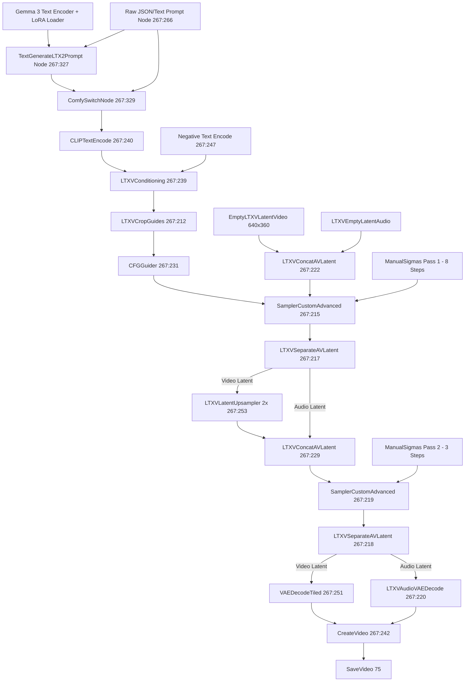

# ComfyUI Workflow Architecture & Node Mapping Reference

## Overview
This document breaks down the production ComfyUI workflow provided in `video_ltx2_3_t2v.json`. It maps every node, tensor connection, and parameter setting to ensure prompts integrate smoothly into the graph.

---

## 1. Complete Workflow Topology



---

## 2. Key Nodes and Parameter Settings

### 1. Prompt Input & Enhancement Subsystem
- **Node `267:266` (`PrimitiveStringMultiline` - "Prompt")**:
  - Contains the master structured scene JSON prompt.
- **Node `267:327` (`TextGenerateLTX2Prompt` - "Generate LTX2 Prompt")**:
  - Uses Gemma 3 text encoder to ingest the JSON prompt and optionally generate an expanded cinematographic prompt.
  - Parameters:
    - `max_length`: `2048`
    - `sampling_mode`: `on`
    - `temperature`: `0.7`
    - `top_k`: `64`
    - `top_p`: `0.95`
    - `min_p`: `0.05`
    - `repetition_penalty`: `1.05`
- **Node `267:329` (`ComfySwitchNode`) & `267:330` (`Boolean Switch`)**:
  - Allows toggling between the enhanced prompt (True) and the raw input prompt string (False).

### 2. Conditioning & Guidance Subsystem
- **Node `267:239` (`LTXVConditioning`)**:
  - Binds the positive prompt, negative prompt, and target FPS together.
- **Node `267:212` (`LTXVCropGuides`)**:
  - Crops conditioning embeddings to match the latent canvas dimensions, preventing spatial drift.
- **Node `267:231` & `267:213` (`CFGGuider`)**:
  - `cfg`: `1.0` (optimal setting for distilled LoRAs; higher CFG causes burn-in with distilled models).

### 3. Sampling Schedules (Manual Sigmas)
- **Pass 1 (Base Generation - 8 steps)**:
  - Node `267:252` (`ManualSigmas`):
    ```text
    1.0, 0.99375, 0.9875, 0.98125, 0.975, 0.909375, 0.725, 0.421875, 0.0
    ```
- **Pass 2 (Upscaled Refinement - 3 steps)**:
  - Node `267:211` (`ManualSigmas`):
    ```text
    0.85, 0.7250, 0.4219, 0.0
    ```

### 4. Dimensions, Pacing & Memory Optimization
- **Math Expressions**:
  - Width: `1280` -> Pass 1 base width: `1280 / 2 = 640`.
  - Height: `720` -> Pass 1 base height: `720 / 2 = 360`.
  - Total frames formula: `Duration * FPS + 1` (e.g. $7 \times 30 + 1 = 211$ frames).
- **Node `267:251` (`VAEDecodeTiled`)**:
  - `tile_size`: `768`, `overlap`: `64`, `temporal_size`: `4096`, `temporal_overlap`: `4`.
  - Decodes high-resolution video frame batches in tiles to prevent GPU VRAM Out-Of-Memory (OOM).

---

## 3. How to Direct from the Prompt

The JSON schema entered into Node `267:266` acts as the single source of truth for the entire graph:
1. **The `ltx_2_3_prompt_scene_X` key**: Contains the master descriptive flowing narrative paragraph passed directly to the diffusion sampler.
2. **The `action_timeline` key**: Ensures the Gemma 3 encoder aligns temporal visual transformations with frame progression.
3. **The `audio` key**: Directs the simultaneous audio latent generator for synchronized foley, dialogue, and room acoustics.
4. **The `negative_prompt_scene_X` key**: Injected into Node `267:247` to steer the model away from artifacts.
