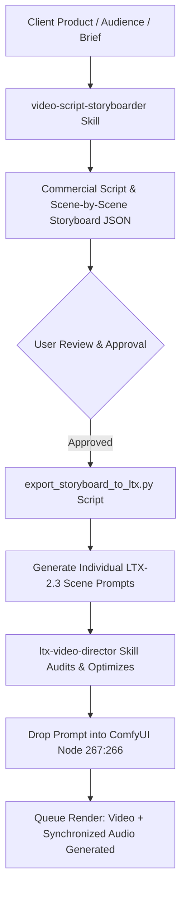

# LTX-2.3 Direct Handoff & Pipeline Integration

## Overview
The primary purpose of **video-script-storyboarder** is to bridge high-level marketing strategy (product positioning, audience pain points, narrative arcs) with low-level generative video execution in **LTX-2.3**.

Every scene card produced by this skill is engineered to map 1-to-1 into the production JSON schema required by the **`ltx-video-director`** skill.

---

## 1. Field-by-Field Translation Matrix

| Storyboard Scene Field | LTX-2.3 Scene Prompt Key | How It Translates in LTX-2.3 |
| :--- | :--- | :--- |
| `scene_number` | `scene.scene_number` | Identifies shot in chronological sequence. |
| `title` | `scene.title` | Conceptual shot label. |
| `timecode` | `scene.timecode` | Temporal slot in master commercial edit (e.g. `00:04-00:10`). |
| `duration_seconds` | `scene.duration_seconds` | Sets frame count in ComfyUI: $\text{Frames} = (\text{Duration} \times \text{FPS}) + 1$. |
| `dramatic_beat` | `scene.purpose` | Defines emotional objective of the shot. |
| `spatial_blocking` | `spatial_blocking` | Dictates Foreground, Midground, and Background room anchors. |
| `action_timeline` | `action_timeline` | Sub-second chronological physical progression. |
| `performance` | `performance` | Physical micro-actions (breath, glances, posture shifts). |
| `camera` | `camera` | Lens focal length, camera height, dolly speed, and settle coordinates. |
| `lighting` | `lighting` | Motivated in-world source, Kelvin temperature, and direction. |
| `campaign_film_stock` | `color_and_finish.film_character` | Kodak Portra 400, Vision3 500T, 250D, or Fuji Eterna. |
| `campaign_lut` | `color_and_finish.grade` | Kodak 2383, Arri Rec.709, Bleach Bypass, or custom palette. |
| `audio` | `audio` | Synchronized foley, room tone acoustics, dialogue in quotes, and music. |
| `negative_prompt` | `negative_prompt` | Anti-CGI, anti-artifact, and prohibited UI elements. |
| `ltx_prompt_preview` | `ltx_2_3_prompt` | Master flowing narrative paragraph ready for ComfyUI Node `267:266`. |

---

## 2. The Production Handoff Workflow



---

## 3. Automated CLI Conversion

The `video-script-storyboarder` skill includes an automated converter script:
```bash
python3 .agents/skills/video-script-storyboarder/scripts/export_storyboard_to_ltx.py path/to/storyboard.json --scene 2 --output scene_2_ltx.json
```
This takes Scene 2 of the multi-scene commercial storyboard and packages it into a validated, standalone LTX-2.3 scene JSON file ready for ComfyUI!
